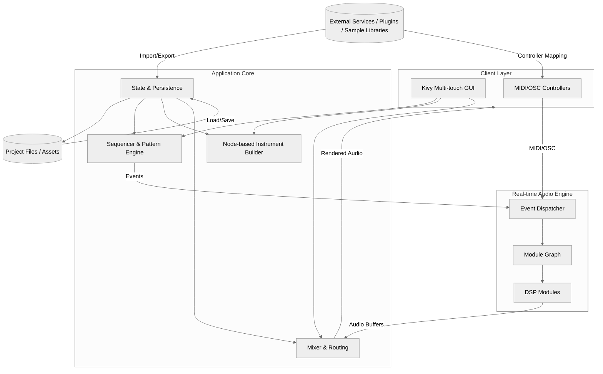
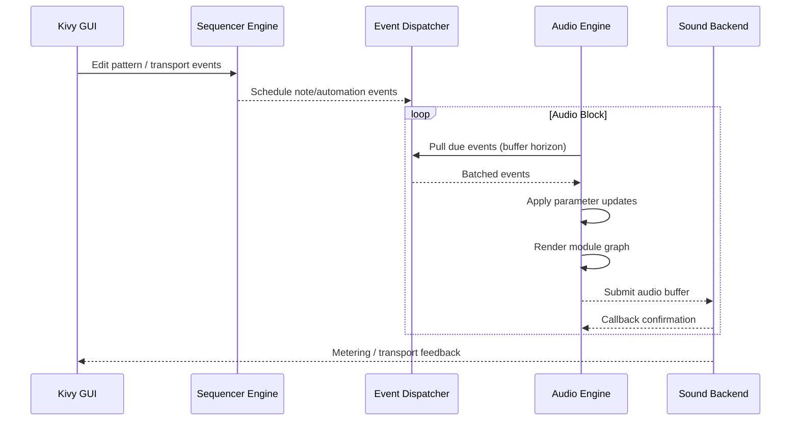
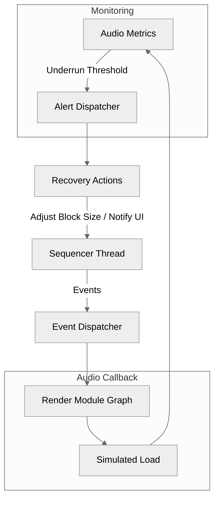
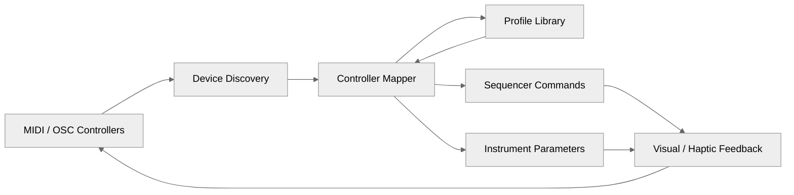

# Step 2 Architecture Diagrams

This document supplements `docs/step2_architecture_tech_choices.md` by providing visual assets that align with the Comprehensive Development Plan outlined in the repository README. Each diagram is stored as a Mermaid source file within `docs/assets/` to keep version control diff-friendly and allow automated rendering in future documentation tooling.

## Component Overview

*Source:* `docs/assets/component_overview.mmd`

## Sequencer to Audio Callback Sequence

*Source:* `docs/assets/sequence_audio_callback.mmd`

## Next Steps

- Export these Mermaid diagrams to SVG/PNG assets when preparing external documentation bundles.
- Extend the sequence diagram set with failure scenarios (buffer underruns, module hot-swap) as prototypes mature.
- Keep controller routing visuals aligned with hardware mapping discoveries during Plan §5 prototyping.

## Audio Engine Failure Modes

*Source:* `docs/assets/audio_failure_modes.mmd`

## Controller Routing Overview

*Source:* `docs/assets/controller_routing.mmd`
