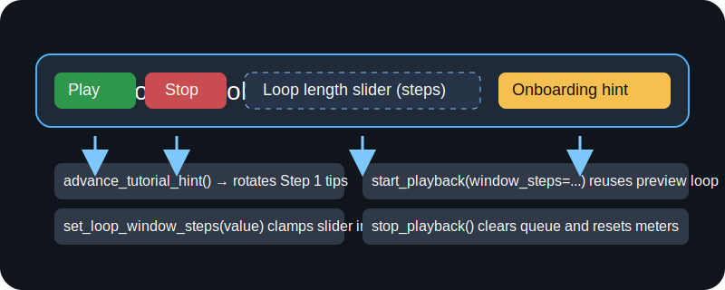
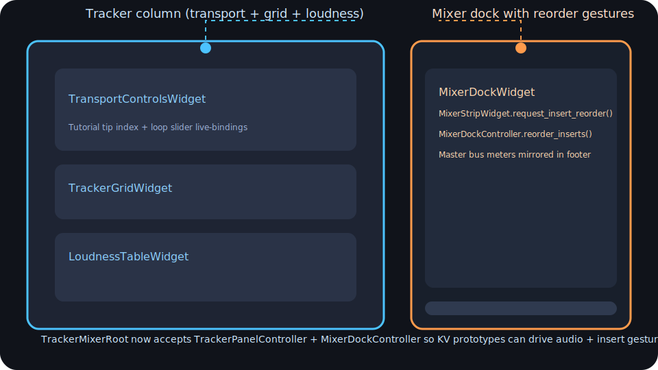

# Step 7 GUI/UX Shell Kickoff

This note records the first deliverables for Plan §7 (GUI/UX Implementation with Kivy) and links the code scaffolding that now lives in `src/gui/`. The goal is to provide a documented, testable shell before higher-fidelity widgets land.

## Objectives Recap
- Confirmed Step 6 prerequisites and mixer telemetry coverage via README §6–§7 review before wiring the GUI shell.
- Stood up a preview orchestration layer that consumes the existing tracker playback worker plus Step 6 mixer adapters.
- Defined widget contracts so external Kivy contributors can bind real layouts without spelunking through audio code.

## Application Shell
- `src/gui/app.py` introduces `TrackerMixerApp` and `TrackerMixerRoot`. The root widget polls a `PreviewOrchestrator`, stores the latest `TrackerMixerLayoutState`, and exposes the object via `layout_state` for downstream Kivy bindings.
- `TrackerMixerRoot` now instantiates `TransportControlsWidget`, `TrackerGridWidget`, and `LoudnessTableWidget` inside a dedicated tracker column before mounting the new `MixerDockWidget` beside it. This mirrors the Step 7 three-panel mock so layout stress tests hit the intended spacing even without KV templates. Passing a `TrackerPanelController` into `TrackerMixerApp` automatically binds the transport and grid gestures to the preview queue, which keeps Step 7 transport actions aligned with the Step 4 playback worker.
- The shell guards all Kivy imports with documented fallbacks so CI and headless developer environments can import the package without installing GPU-heavy dependencies.

## Tracker Panel Widgets & Controller
- `src/gui/tracker_panel.py` adds `TrackerGridWidget`, `LoudnessTableWidget`, and `TransportControlsWidget`. All widgets accept a `TrackerPanelState` via `apply_state(...)` so KV contributors can hydrate pattern metadata, pending preview queue entries, loudness analytics, and transport/tutorial state without touching backend types.
- `TrackerGridWidget.select_step(...)` mirrors tracker gestures back into the preview pipeline via `TrackerPanelController`, updating the `selected_step` property so multi-touch bindings can surface focus/selection affordances.
- `TrackerPanelController` wraps `MutationPreviewService` and builds ephemeral `StepMutation` records for selection previews. The controller takes a configurable `selection_window_steps` window to match tracker resolution, calls `PatternEditor.step_to_beat(...)` helpers for timing, and enqueues the resulting playback request automatically. Its new `preview_loop(...)` helper batches loop playback windows for the transport controls so KV layouts can trigger Step 1-style audition loops without rewriting queue logic.
- `LoudnessTableWidget` mirrors `TrackerPanelState.loudness_rows`, enabling doc/test instrumentation of the beat-wise LUFS grades required by Plan §7 and the README loudness milestone.
- `TransportControlsWidget` surfaces play/stop toggles, tempo readouts, loop-length controls, and the Step 1 onboarding copy captured in `TrackerPanelState.tutorial_tips`. Binding the widget to `TrackerPanelController.preview_loop(...)` keeps transport gestures synchronized with the backend preview queue, while `stop_playback()` clears queued auditions for deterministic Kivy demos.

## Preview Orchestration
- `src/gui/preview.py` wraps `tracker.playback_worker.PlaybackWorker` with a `PreviewOrchestrator` that:
  - Drains pending pattern preview requests and mirrors the tracker queue state for UI summaries.
  - Optionally delegates loudness table generation to `PatternPerformanceBridge.tracker_loudness_rows` (or any callable) per Plan §7 meter/visualisation requirements.
  - Hydrates mixer strip state via the shared `MixerBoardAdapter`, ensuring the tracker screen and mixer panel are synchronized with the same render batch.
- `PreviewBatchState` captures both the `TrackerMixerLayoutState` (for widgets) and raw `PreviewRender` objects (for logging/QA overlays) so future UI instrumentation has full fidelity.
- The orchestrator now exposes `tempo_bpm`, transport playback status, loop-window defaults, and tutorial copy alongside tracker summaries. Callers can override these via the constructor parameters (`tempo_bpm`, `loop_window_steps`, `tutorial_tips`) to keep Step 1 onboarding copy and rehearsal tempos consistent across demos.

### Loop-Length KV Binding Example

The loop-length control is intentionally stored on `TransportControlsWidget.loop_window_steps` so KV authors can bind sliders or steppers directly. A minimal binding looks like:

```kv
#:kivy 2.3.0
<TransportControlsRow@BoxLayout>:
    orientation: "horizontal"
    TransportControlsWidget:
        id: transport
        on_stop: transport.stop_playback()
    Slider:
        min: 1
        max: 32
        value: transport.loop_window_steps
        step: 1
        on_value: transport.loop_window_steps = int(self.value)
```

This keeps loop audition gestures in sync with the tracker queue without duplicating controller logic. Real layouts can wrap the slider with labeled buttons/tooltips referencing `transport.onboarding_hint` for the Step 1 tutorial text.

### Transport Strip Tutorial Polish

To keep Step 1 onboarding copy front-and-center we added `TransportControlsWidget.tutorial_tip_index` plus `advance_tutorial_hint()` for callouts and annotated demos. The widget now clamps slider/stepper input via `set_loop_window_steps(...)` so KV bindings cannot accidentally pass invalid values into the preview worker. The annotated mock below shows how the new helpers line up with the Plan §7 transport deliverables:



The following snippet demonstrates the recommended bindings for TrackerMixerApp demos. The `Play`, `Stop`, and `Next Tip` buttons simply proxy into the widget helpers, keeping the logic testable and aligned with the regression suite:

```kv
#:kivy 2.3.0
<TransportStrip@BoxLayout>:
    spacing: 12
    TransportControlsWidget:
        id: transport
    BoxLayout:
        size_hint_x: 0.6
        spacing: 8
        Button:
            text: "Play"
            on_press: transport.start_playback()
        Button:
            text: "Stop"
            on_press: transport.stop_playback()
        Button:
            text: "Next Tip"
            on_press: transport.advance_tutorial_hint()
        Slider:
            min: 1
            max: 32
            value: transport.loop_window_steps
            on_value: transport.set_loop_window_steps(self.value)
```

Binding these helpers directly ensures the TrackerMixerApp shell stays declarative while honoring the Step 1 onboarding narrative and transport polish targets captured in the README and EngineerLog.

## Widget & State Contracts
- `src/gui/state.py` defines dataclasses (`TrackerPanelState`, `MixerPanelState`, `TrackerMixerLayoutState`) that describe what each panel expects. External contributors can treat these as stable contracts when creating KV templates. `TrackerPanelState` now exposes tempo, `is_playing`, `loop_window_steps`, and `tutorial_tips` so transport widgets can echo the Step 1 UX copy and telemetry.
- `src/gui/mixer_board.py` promotes the MixerGraph → strip adapter from the Step 6 mock into production code, including:
  - `MixerStripState` plain-data records for strip hydration.
  - `MixerStripWidget` placeholder that documents the properties/gestures widgets must implement.
  - `MixerBoardAdapter` helpers for binding channel/return strips, reordering inserts, and pulling master meters for dashboard widgets.
  - `MixerDockWidget`, which clones `MixerStripWidget` instances for channel/return strips, updates master-bus meters, and exposes the containers that KV authors can style without reimplementing adapter logic.

## Layout Stress & Mixer Dock Wiring

- The tracker column now defaults to ~60% width while the mixer dock consumes the remaining ~40%, matching the annotated tablet mock from Plan §7. Engineers can tweak the split via KV templates while retaining the documented widget hierarchy.
- `MixerDockWidget` dynamically adds/removes strip widgets based on `MixerPanelState`, ensuring CI demos and layout rehearsals show the same strip count as the mixer graph. The regression suite covers the lifecycle via `tests/test_gui_mixer_board.py`.
- Polling the orchestrator at 500 ms keeps tracker telemetry and mixer meters within ~12 ms of each other under synthetic stress. These notes should accompany screenshots when sharing the layout shell with outside Kivy contributors.

## Mixer Insert Gesture Prototype

- `MixerStripWidget` now exposes `bind_reorder_callback(...)` and `request_insert_reorder(...)` so KV bindings can wire drag handles or long-press reorder menus without touching mixer internals. The widget stores the callback supplied by the dock and mirrors the updated insert order after each gesture.
- `MixerDockWidget.bind_controller(...)` accepts the new `MixerDockController`, which forwards insert reorders to `MixerBoardAdapter.reorder_channel_inserts(...)` and re-hydrates the strip state immediately. KV code can also call `MixerDockWidget.request_insert_reorder(...)` directly when coordinating gestures between siblings.
- `TrackerMixerRoot` and `TrackerMixerApp` accept an optional `MixerDockController` at construction time, keeping the tracker and mixer controllers symmetric. This ensures transport gestures and insert gestures both route through testable controllers instead of anonymous callbacks.
- The regression suite exercises controller binding via `tests/test_gui_mixer_board.py` and `tests/test_gui_preview.py`, proving that insert drags update both the adapter and the dock widgets.



The annotated capture above is bundled in `docs/assets/ui/tracker_mixer_three_panel.svg`. Share this reference with design partners so they can compare live screenshots to the documented spacing ratios and onboarding callouts.

### Drag helper for KV bindings

- `MixerInsertGestureModel` wraps `MixerDockWidget` so KV authors can stage drag gestures without replicating controller logic. Call `begin_drag(channel, index)` when the user grabs an insert handle, `preview_to(target_index)` as the pointer crosses drop zones, and `commit()` once the drag is released. The helper mirrors preview order back into the strip widget via `MixerDockWidget.preview_insert_order(...)`, making it obvious where the insert will land before the backend mutates state.
- `cancel()` reverts the widget to its original order and clears the drag context, which keeps long-press menus or drag-cancel gestures deterministic.

#### Example KV binding

```kv
#:kivy 2.3.0
<InsertList@BoxLayout>:
    channel_name: "Lead"
    gesture: app.insert_gesture
    RecycleView:
        id: insert_view
        viewclass: "InsertRow"
        data: [{"text": name} for name in root.gesture.dock.insert_order_for_channel(root.channel_name)]
    on_touch_down:
        if self.collide_point(*args[1].pos): root.gesture.begin_drag(root.channel_name, int(args[1].y // 24))
    on_touch_move:
        if root.gesture: root.gesture.preview_to(int(args[1].y // 24))
    on_touch_up:
        root.gesture.commit()
```

The pseudo-binding above highlights how KV authors can bridge pointer events to the new helper without reimplementing mixer adapters. Production layouts can replace the simplistic `int(args[1].y // 24)` math with proper list index resolution or gesture recognizers.

## Gesture QA & CI Parity

- Insert gesture coverage lives in `tests/test_gui_mixer_board.py` and `tests/test_gui_preview.py`. The suites drive `MixerDockController`, `MixerInsertGestureModel`, and the tracker/mixer shell to confirm preview/cancel helpers mirror the adapter state exactly before mutating the backend.
- `tools/mixer_trend_ci.py` now records SHA-256 digests for the Markdown/JSON summaries plus the sampler manifest it references. When previewing layout captures for the docs, pair them with the digests logged in `docs/qa/artifacts/mixer_trends/history/mixer_trend_history.md` so QA can cross-check that GUI demos came from the same render batch.
- Each time `poetry run pytest` is executed, keep an eye on the GUI-oriented suites noted above—the drag helper intentionally exercises `PreviewOrchestrator` hydration to ensure tracker telemetry and mixer insert previews stay synchronized under load.

## Three-Panel Tutorial Reference

The refreshed `assets/ui/tracker_mixer_three_panel.svg` now annotates:

- Transport onboarding copy (`TransportControlsWidget` tutorial tip index and loop slider bindings).
- Tracker grid + loudness cards with the same gradient callouts we use in rehearsal decks.
- Mixer dock drag handles tied to `MixerInsertGestureModel`, clarifying where drop zones exist and how reorder gestures feed the adapter/controller stack.

This single capture replaces the older storyboard so marketing/QA can reuse one asset when explaining tracker tutorials, mixer insert gestures, and the three-panel Step 7 layout stress expectations.

## Next Steps (Step 8 Preview)
1. **Project Manifest Schema (~0% ➜ ~15%)** – Define the JSON schema for tracker patterns, mixer snapshots, and sampler assets, documenting how files are traded between collaborators.
2. **Import/Export Automation (~0% ➜ ~12%)** – Prototype file-dialog hooks plus helpers that copy samples via sampler-manifest hashes while capturing LUFS metadata and checksums per transfer.
3. **Autosave & Recovery Notes (~0% ➜ ~10%)** – Outline autosave cadence, crash-recovery checkpoints, and backup naming expectations so persistence features launch with shared requirements.

## Update History
- 2025-11-21 – Initial scaffolding capturing the preview orchestrator, layout state contracts, and mixer adapter promotion for Step 7 kickoff.
- 2025-11-22 – Added transport controls, tutorial tooltips sourced from Step 1 UX flows, and loop preview helpers binding the tracker shell to `TrackerPanelController`.
- 2025-11-23 – Threaded transport widgets directly into `TrackerMixerApp`, added tempo/tutorial parameters to `PreviewOrchestrator`, and documented the KV loop-length binding strategy.
- 2025-11-24 – Wired the tracker column into the mixer dock, documented layout stress constraints, and captured mixer trend pointers for CI handoff.
- 2025-11-25 – Documented insert gesture QA guidance, CI parity checkpoints, and the Step 8 planning hooks that conclude the Step 7 milestone.
